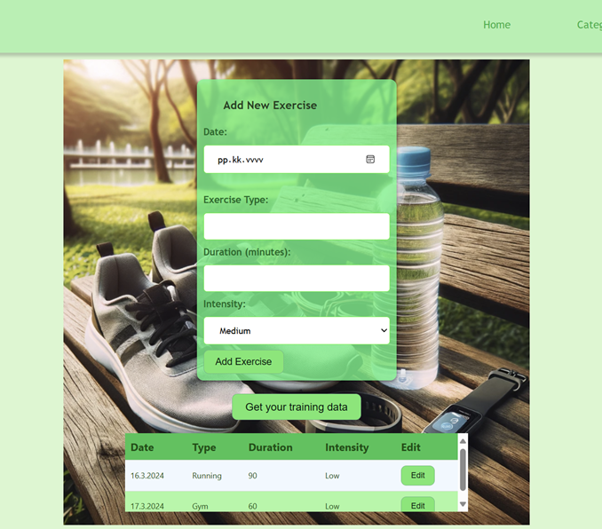

# HealthDiary application

HealthDiary provides a convenient and user-friendly way to record and monitor information related to health, such as exercise, nutrition, heart rate variability (HRV), and medication.

This repository contains both the back-end server and the front-end client for the HealthDiary application. The back-end is built with Node.js and Express, providing RESTful APIs, while the front-end is served from the `public` directory and is responsible for the user interface.


### Login page of the application.


### Home page after logging in.


### Exercise category



### Usage (Back-End)

The back-end server is a Node.js + Express application that interacts with a MySQL/MariaDB database to manage health-related data.

To get the back-end server running locally, follow these steps:

## Usage

1. Clone/download code
2. Run `npm i` inside project folder
3. Install & start MySQL/MariaDB server
4. Import database script(s) in `db/` folder
5. Create `.env` file based on `.env.sample`
6. Start the dev server: `npm run dev` / `npm start`

## Front-End Client

The front-end client is a web application located in the `public` directory. It interacts with the back-end server to present data and provide an interactive user interface.

## Database

Scripts for database can be found from file named health-diary.sql.
Structure of the database shown below.


## Resources and endpoints

### `/items` (works with hard-coded mock data only, no need for db)

```http
GET http://127.0.0.1:3000/items
GET http://127.0.0.1:3000/items/:id
DELETE http://127.0.0.1:3000/items/:id

POST http://127.0.0.1:3000/items
content-type: application/json
body: {"name": "New Item"}
```

### `/api/auth`

```http
# Login
POST http://localhost:3000/api/users/login
content-type: application/json

## Get user by token (requires token)
GET http://localhost:3000/api/auth/me
Authorization: Bearer <token>
```

### `/api/users`

```http
# Get all users (requires token)
GET http://127.0.0.1:3000/api/users
Authorization: Bearer <token>

# Get user by id (requires token)
GET http://127.0.0.1:3000/api/users/:id
Authorization: Bearer <token>

# Delete user (requires token)
DELETE http://127.0.0.1:3000/api/users/:id
Authorization: Bearer <token>

# Create user (register)
POST http://127.0.0.1:3000/api/users
content-type: application/json

# Update user's own data (requires token)
PUT http://127.0.0.1:3000/api/users/
Authorization: Bearer <token>
content-type: application/json


```

### `/api/entries`, used to get, post, put and delete Diary entries in the application.

```http
# Get all entries for a logged in user (requires token)
GET http://localhost:3000/api/entries
Authorization: Bearer <token>

# Get entries by id
GET http://localhost:3000/api/entries/:id

# Post entry
POST http://localhost:3000/api/entries
content-type: application/json

# Update entry
PUT http://localhost:3000/api/entries/:id
content-type: application/json

# Delete entry
DELETE http://localhost:3000/api/entries/:id
```
### `api/entries/exercise/:id`, used to get, post, put and delete exercise entries in the application

```http
# Get all exercise entries for a logged in user (requires token and user_id)
GET http://localhost:3000/api/entries/exercise/:id
Authorization: Bearer <token>

# Post exercise entry for a logged in user (requires token and user_id)
POST http://localhost:3000/api/entries/exercise/:id
content-type: application/json
Authorization: Bearer <token>

# Update exercise entry for a logged in user(requires token and user_id
PUT http://localhost:3000/api/entries/exercise/:id
content-type: application/json
Authorization: Bearer <token>

# Delete exercise entry (requires token and exercise_id)
DELETE http://localhost:3000/api/entries/exercise/:id
```
### `api/entries/hrv/:id`, used to get, post, put and delete hrv entries in the application

```http
# Get all hrv entries for a logged in user (requires token and user_id)
GET http://localhost:3000/api/entries/hrv/:id
content-type: application/json
Authorization: Bearer <token>

# Post hrv entry for a logged in user (requires token and user_id)
POST http://localhost:3000/api/entries/hrv/:id
content-type: application/json
Authorization: Bearer <token>

# Update hrv entry for a logged in user(requires token and user_id
PUT http://localhost:3000/api/entries/hrv/:id
content-type: application/json
Authorization: Bearer <token>

# Delete hrv entry (requires token and hrv_id)
DELETE http://localhost:3000/api/entries/hrv/:id
Authorization: Bearer <token>
```
### `api/entries/medications/:id`, used to get, post, put and delete medication entries in the application

```http
# Get all medication entries for a logged in user (requires token and user_id)
GET http://localhost:3000/api/entries/medications/:id
content-type: application/json
Authorization: Bearer <token>

# Post medication entry for a logged in user (requires token and user_id)
POST http://localhost:3000/api/entries/medications/:id
content-type: application/json
Authorization: Bearer <token>

# Update medication entry for a logged in user(requires token and user_id
PUT http://localhost:3000/api/entries/medications/:id
content-type: application/json
Authorization: Bearer <token>

# Delete hrv entry (requires token and medication_id)
DELETE http://localhost:3000/api/entries/medications/:id
Authorization: Bearer <token>
```
### `api/entries/nutrition/:id`, used to get, post, put and delete nutrition entries in the application

```http
# Get all nutrition entries for a logged in user (requires token and user_id)
GET http://localhost:3000/api/entries/nutrition/:id
content-type: application/json
Authorization: Bearer <token>

# Post nutrition entry for a logged in user (requires token and user_id)
POST http://localhost:3000/api/entries/nutrition/:id
content-type: application/json
Authorization: Bearer <token>

# Update nutrition entry for a logged in user(requires token and user_id
PUT http://localhost:3000/api/entries/nutrition/:id
content-type: application/json
Authorization: Bearer <token>

# Delete nutrition entry (requires token and nutrition_id)
DELETE http://localhost:3000/api/entries/nutrition/:id
Authorization: Bearer <token>
```

